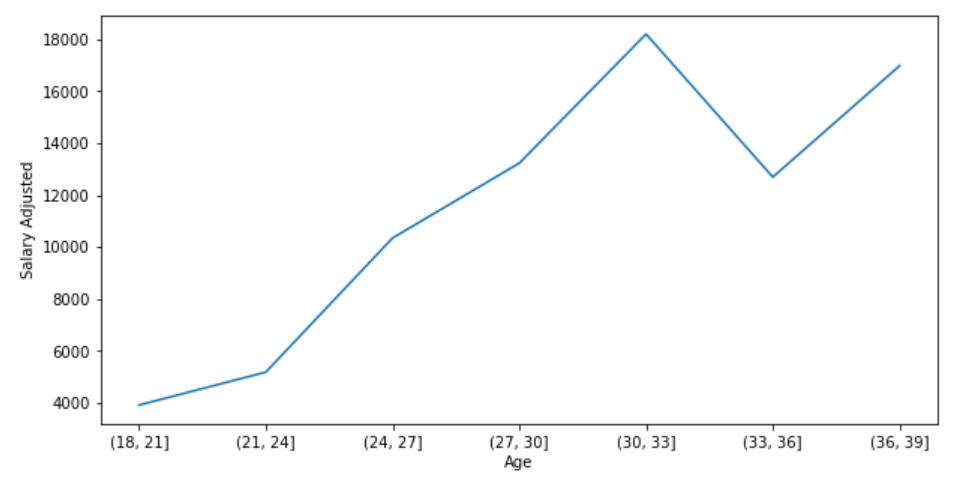
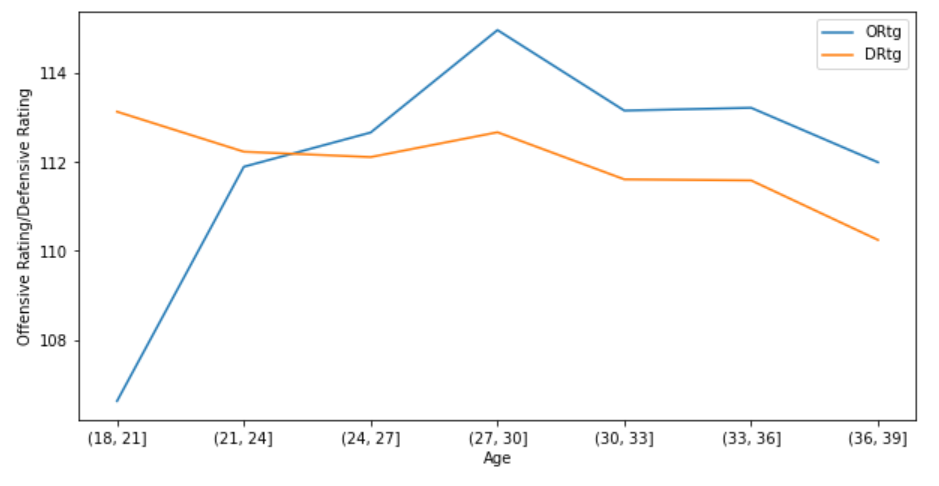
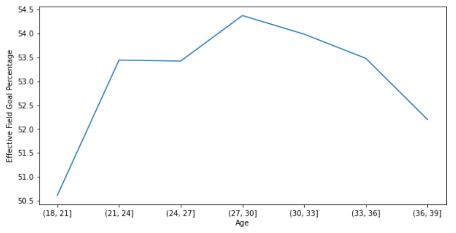
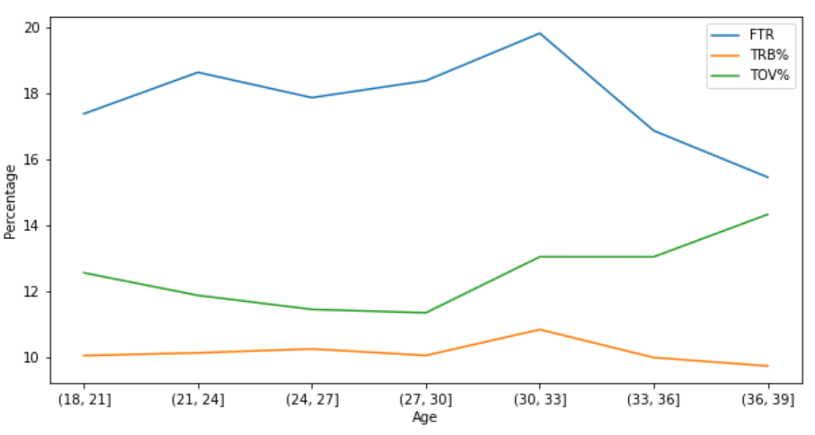
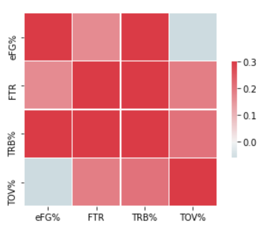
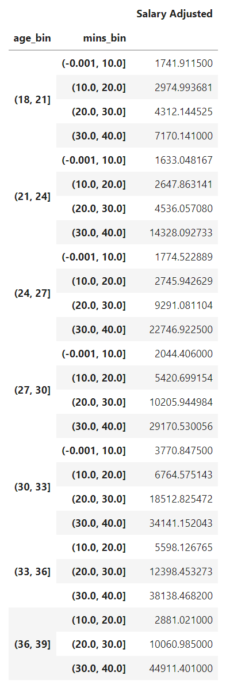
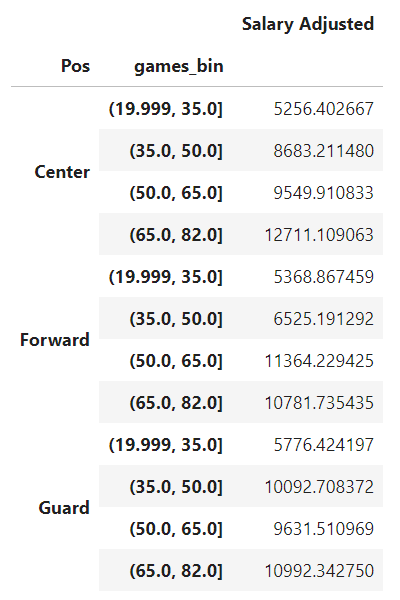

# NBA Salary Projection
- Created a tool comparing model projected salary to player actual salary.
- Scraped player advanced and basic stats from basketball-reference.
- Scraped player salary data from hoopshype.com.
- Compared Ratings model and Four Factors Model
- Transformed some numerical features to categorical features through binning.
- Optimised Lasso, Random Forest and Support Vector Regressor using GridSearchCV.
- Built a client displaying the tables using Flask and HTML.

## Code and Resources Used
**Python Version**: 3.8.8 

**Packages**: pandas, sklearn, matplotlib, beautifulsoup, flask, json

**Web Framework Requirements**: ``` pip install -r requirements.txt ```

## Background Information
The Ratings Model involves the inclusion of Offensive Rating, Defensive Rating, Offensive Box Plus Minus and Defensive Box Plus Minus. Offensive and Defensive Rating are metrics developed by Dean Oliver in order to estimate a player's production on the offensive and defensive end per 100 individual possessions. The calculation involves a wide range of basic traditional box score statistics such as points, rebounds, assists, etc in an attempt to cover everything that can happen offensively and defensive. The methodology for such calculation can be found [here](https://www.basketball-reference.com/about/ratings.html). Furthermore, Offensive and Defensive Box Plus Minus are developed in order to estimate a player's contribution when he is on the court, and utilies traditional stats to estimate the role of the player for adjustments. Full information on Offensive and Defensive Box Plus Minus can be found [here](https://www.basketball-reference.com/about/bpm2.html).

The Four Factors model involes the usage of the four factors introduced by Dean Oliver, which includes effective field goal percentage, turnover percentage, team rebound percentage and free throws rate. It aims to cover all aspects of a basketball game. Further information can be found [here](https://www.basketball-reference.com/about/factors.html)

## Web Scraping 
We get data tables from basketball-reference like [this](https://www.basketball-reference.com/leagues/NBA_2022_per_game.html) and from hoopshype like [this](https://hoopshype.com/salaries/players/2021-2022/).

## Data Cleaning
The data retrieved required cleaning in order for it to be usable for the model. The following was done:
- Seperated columns required from different dataframes scraped (basic stats, advanced stats, per 100 possession stats, salary), which was initially seperated by each season.
- Matched names of players (different website have different interpretation of player names).
- Merged the columns into one dataframe.
- Generalised positions into guards, forwards and centers.
- Removed rows for players that played less than 20 games.
- Parsed numeric data out of salary.
- Created new column for free throw rate.
- Binned age, games, games started, minutes.

## EDA
      

## Model Building
The decision to use adjusted salary as the output for the model is because it adjusts the player's salary to inflation, and provides a better notion for the amount a player should be paid today. It eliminates the confusion where players earn different amounts due to the change in salary cap each season. For example, Paul George earned around 39 million in 2021-22, but he will be making 42.5 million in 2022-23 despite being on the same contract. Similarly, the NBA's salary cap increased by 12 million from 2021-22 to 2022-23.

The first step to building the model is to transform all categorical variables into dummy variables. The data is then split into train and test sets randomly with test size of 20%. In addition, a cube root transformation of the output data was performed since it followed an exponential distribution (assumption for most linear models are that the output follows a normal distribution). Standardisation was used as a second transformation when attempting support vector regression.

Four different models were used and was evaluated using Mean Absolute Error.
- **Linear Regression**: Most common and baseline for the model
- **Lasso Regression**: Accounts for some multicollinearity between features.
- **Random Forest**: Also accounts for multicollinearity with its classification feature.
- **Support Vector Regression**: More complex model with more regularisation in order to test for better results.

## Model Evaluation

## Productionisation
A flask API endpoint was used in order to host a local server, which displays the data with search and sort tools for ease of access.
